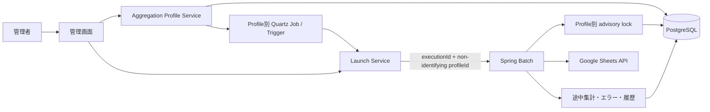
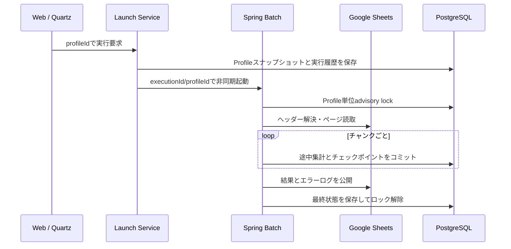

# 汎用売上自動集計システム

[](https://github.com/snpiogw/UriageJidouShukei/actions/workflows/ci.yml)

複数のGoogleスプレッドシートに入力された売上データを、商品・担当者・月ごとに集計するSpring Bootアプリケーションです。小規模事業者や店舗ごとに集計設定（Aggregation Profile）を登録し、異なるシート名、列名、税設定、実行時刻を管理できます。

## 主な機能

- 複数のGoogleスプレッドシートをProfile単位で管理
- 日付・担当者・商品名・数量・単価のヘッダー名を設定可能
- 列順変更と関係のない追加列に対応
- Profileごとの手動実行、状態フィルター・ページング付き実行履歴、次回実行時刻
- Profileの無効化、最終実行結果、Googleスプレッドシートへの直接リンク
- ProfileごとのQuartz永続スケジュール
- Spring Batchによるチャンク処理、チェックポイント、失敗地点からの再開
- Profile単位のPostgreSQL advisory lock（別Profileは同時実行可能）
- 不正行の除外、エラーログ出力、最大10,000件の入力
- 税抜・税込、税率0〜100%、行単位の端数処理
- Spring Security、BCrypt、CSRF、CSP、HttpOnly/SameSite Cookie
- Google API接続・読込タイムアウト、実行履歴の保持期限、再開試行ごとの監査履歴
- Flyway、PostgreSQL、Quartz JDBC JobStore、Docker Compose

## 構成図



Web層はJPA Entityを直接操作せず、Application Serviceと読み取り専用ViewModelを介します。集計開始時のProfile設定は実行履歴へスナップショット保存されるため、実行中や失敗後にProfileが編集されても、再開対象の入力元・列マッピング・出力先は変わりません。

## Aggregation Profile

各Profileは次の設定を持ちます。

| 分類 | 設定 |
|---|---|
| 基本 | 設定名、Spreadsheet ID |
| シート | 入力、集計結果、エラーログのシート名 |
| 列 | 日付、担当者、商品名、数量、単価のヘッダー名 |
| 集計 | 税区分、税率 |
| スケジュール | 自動実行ON/OFF、実行時刻、タイムゾーン |
| 管理 | 有効/無効、version、作成日時、更新日時、更新者 |

初期Profileの列マッピングは従来と同じです。

| 日付 | 担当者 | 商品名 | 数量 | 単価 |
|---|---|---|---:|---:|
| 2026-08-01 | 田中 | 商品A | 2 | 1200 |

ヘッダーは入力シートの1行目から検索します。前後空白を除いて設定値と一致する列を使用するため、次のような順序でも集計できます。

| メモ | 商品 | 価格 | 販売日 | 個数 | 担当 |
|---|---|---:|---|---:|---|

この場合は `販売日 / 担当 / 商品 / 個数 / 価格` を列マッピングへ指定します。対象列の欠落や重複はエラーです。ヘッダー行自体は1行目固定です。

## 利用例

| 設定名 | Spreadsheet | 入力シート | 自動実行 |
|---|---|---|---|
| 店舗A | sheet-a | 売上 | 21:00 Asia/Tokyo |
| 店舗B | sheet-b | Sales | 22:30 Asia/Tokyo |
| 催事集計 | sheet-a | 催事売上 | OFF |

同じSpreadsheet IDでも入力シートが異なれば登録できます。ただし誤上書きを防ぐため、同一Spreadsheet内の入力・集計結果・エラーログの各シートは、別Profileと共有できません。設定名、および `Spreadsheet ID + 入力シート名` も重複できません。

## Batchと再開



Spring Batchのidentifying JobParameterは `executionId` だけです。`profileId` と `requestedAt` はnon-identifyingであり、V3以前に作成されたJobInstanceも同じ `executionId` で再開できます。Batch内部は原則として `executionId` から実行スナップショットを取得します。V5以降は、再開のたびに試行番号、状態、処理時間、エラーコードを別履歴として保持するため、再開成功後も最初の失敗原因を確認できます。

同じProfileの多重実行は防止しますが、Profile AとProfile BはBatch executorの範囲内で同時実行できます。途中集計テーブルと行エラーはexecution ID単位です。結果公開後は途中集計だけを削除し、入力エラーと実行履歴は保持します。

## Quartzスケジュール

Profileごとに独立したJobDetailとCronTriggerをQuartz JDBC JobStoreへ保存します。設定変更時は対象ProfileのTriggerだけを更新し、自動実行OFFではそのTriggerだけを解除します。

アプリ起動時にはDBの全Profileと永続Triggerを照合します。旧バージョンの単一TriggerはV4移行後に削除され、初期Profile用のTriggerへ置き換わります。Spreadsheet IDが未設定のProfileにはTriggerを作成しません。

## DB構成

Flyway V4で、既存データを保持したまま次の変更を行います。

- `aggregation_settings` を `aggregation_profile` へ移行
- ID=1を「既存設定」Profileとして保持
- Spreadsheet、シート、列マッピング、作成日時を追加
- 新規Profile用のIDシーケンスを追加
- `aggregation_execution.profile_id` を追加
- 実行時のSpreadsheet、シート、列、タイムゾーンを履歴へスナップショット保存
- Profile別履歴用インデックスと重複制約を追加

V1/V2/V3は変更しません。Spring Batchメタデータ、Quartzメタデータ、途中集計、エラーの既存テーブルも維持します。

Flyway V5ではProfileの有効/無効と、再開試行の監査テーブルを追加します。既存実行には現在の最終状態を試行1として補完します。V6では既存の完了済み実行に残っていた途中集計だけを削除し、保持期限削除用のインデックスを追加します。完了済み実行は既定180日後に関連データごと削除され、保持日数は環境変数で変更できます。

## V3以前からの移行

1. DBをバックアップします。
2. V4を含むアプリケーションを起動します。
3. Flywayが既存のID=1設定を初期Profileへ移行します。
4. 初期ProfileのSpreadsheet IDが空の場合だけ、`GOOGLE_SPREADSHEET_ID` から一度だけ補完します。
5. 同時に、V4以前の実行履歴で不足しているスナップショットを初期Profileから補完します。
6. 管理画面で初期Profileと次回実行予定を確認します。

一度DBへ補完されたSpreadsheet IDは、後の起動で環境変数から上書きされません。既存実行スナップショットも空の場合だけ補完し、Profile編集によって過去履歴を書き換えません。

`GOOGLE_SPREADSHEET_ID` とDBの両方が空でもアプリは起動します。管理画面では「要設定」と表示され、手動・自動実行は設定完了まで行われません。新規Profileは常にDBで管理します。

## 起動方法

### 必要なもの

- Java 21（ローカル実行時）
- Docker Desktop
- Google Sheets APIを有効にしたGoogle Cloudプロジェクト
- 編集権限を持つサービスアカウントJSON

```bash
cp .env.example .env
mkdir -p secrets
```

`secrets/google-service-account.json` を配置し、対象スプレッドシートをサービスアカウントへ共有します。管理パスワードはBCryptで設定してください。

```bash
docker run --rm httpd:2.4-alpine htpasswd -bnBC 12 "" "任意の管理者パスワード" | tr -d ':\n'
docker compose --profile app up --build
```

[http://localhost:8080](http://localhost:8080) へログインし、「新規登録」または初期Profileの「編集」からSpreadsheet IDを設定します。

HTTPS環境では `SESSION_COOKIE_SECURE=true` にしてください。`ADMIN_PASSWORD_HASH` が空の場合、アプリは安全のため起動しません。

### 運用設定

| 環境変数 | 既定値 | 用途 |
|---|---:|---|
| `SHEETS_CONNECT_TIMEOUT_MILLIS` | `5000` | Google APIへの接続待ち上限 |
| `SHEETS_READ_TIMEOUT_MILLIS` | `30000` | Google API応答待ち上限 |
| `EXECUTION_HISTORY_DAYS` | `180` | 完了済み実行履歴の保持日数 |
| `EXECUTION_CLEANUP_CRON` | `0 15 3 * * *` | 履歴削除時刻（Asia/Tokyo） |

バックアップ、復元、監視、障害時の確認順は [運用手順](docs/operations.md)、提出時の説明順は [2分デモ手順](docs/portfolio-demo.md) を参照してください。

### 既存環境用Spreadsheet ID

```dotenv
# V3以前からの移行時だけ使用。新規環境では空で構いません。
GOOGLE_SPREADSHEET_ID=
```

## 入力検証

- 日付: Google Sheetsの日付セル、または `yyyy-MM-dd`
- 担当者・商品名: 必須、100文字以内
- 数量: 0以上1,000,000,000以下の整数
- 単価: 0円以上1,000,000,000,000円以下の整数
- Profile税率: 0〜100、小数4桁以内
- Profileタイムゾーン: Java `ZoneId` として有効な値
- シート名: 必須、100文字以内、Google Sheetsで使用できない文字を禁止

完全な空白行と、列マッピング対象がすべて空の行は件数に含めません。不正行は除外し、行番号、項目、エラーコード、修正方法を保存・出力します。有効行が0件の場合、前回の集計結果は保持し、エラーログだけを更新します。

## セキュリティと秘密情報

- 管理者認証はBCryptハッシュを使用
- POST操作はSpring SecurityのCSRF保護対象
- CSPとframe denyを設定
- Session CookieはHttpOnly/SameSite=Lax
- `.env`、`credentials*.json`、`secrets/` は `.gitignore` と `.dockerignore` の対象
- 画面やGoogle Sheetへスタックトレースや秘密情報を出力しない

サービスアカウントJSONや実パスワードをGitへ追加しないでください。

## テスト

```bash
./mvnw verify
```

単体テストでは、既存の税計算・入力検証・再開処理に加え、列順変更、Profile重複、出力衝突、Legacy補完、JobParameter互換、Profile別Quartz、Profile別ロック、無効Profileの起動拒否を確認します。Dockerが利用できる環境ではTestcontainersによりPostgreSQL 17へV1〜V6を適用し、既存履歴の試行履歴への移行、JPA、Quartz JDBCスキーマも検証します。

実Google Sheetsを使う確認項目は `docs/acceptance-test.md` にあります。

## 残存する制約

- ヘッダー行は1行目固定です。
- 入力上限は既定10,000件、エラー詳細のDB保存は最大500件です。
- Google Sheetsの登録時ヘッダー検証にはネットワーク、API権限、共有設定が必要です。
- Google APIは接続5秒・応答30秒でタイムアウトします。長時間処理が必要な環境では環境変数で調整してください。
- 出力直前の通信断ではGoogle側の反映有無を完全には判定できません。同じ実行結果で再度上書き可能な形式にしています。
- Profile削除機能は未提供です。履歴と外部キーを保護するため、現バージョンは登録・編集・無効化を対象にしています。
- 管理者は単一ユーザー構成です。
- Batch executorとQuartz thread poolはともに既定2スレッドです。多数Profileの同時起動はキュー待ちになります。
- 大規模化時はGoogle APIクォータ、partition step、出力方式の再設計が必要です。
