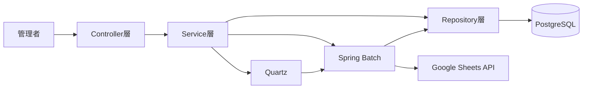
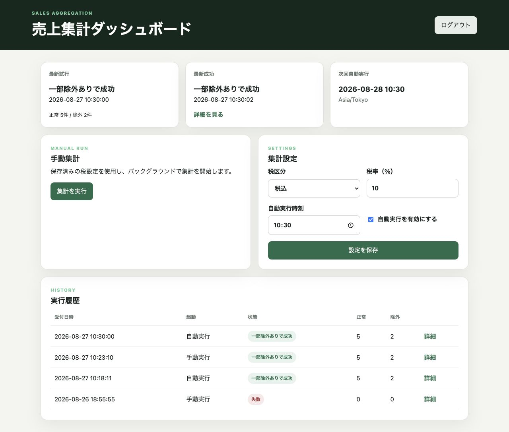
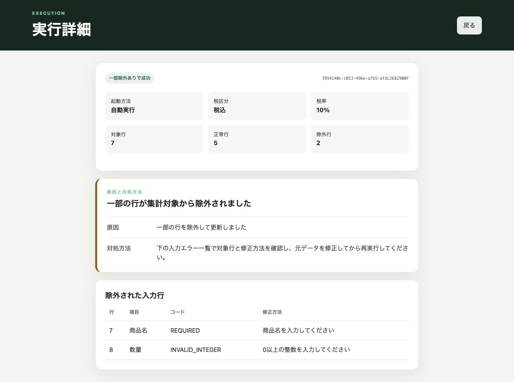
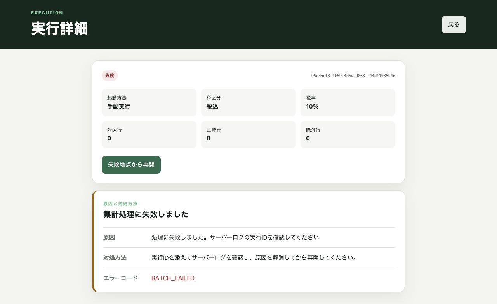
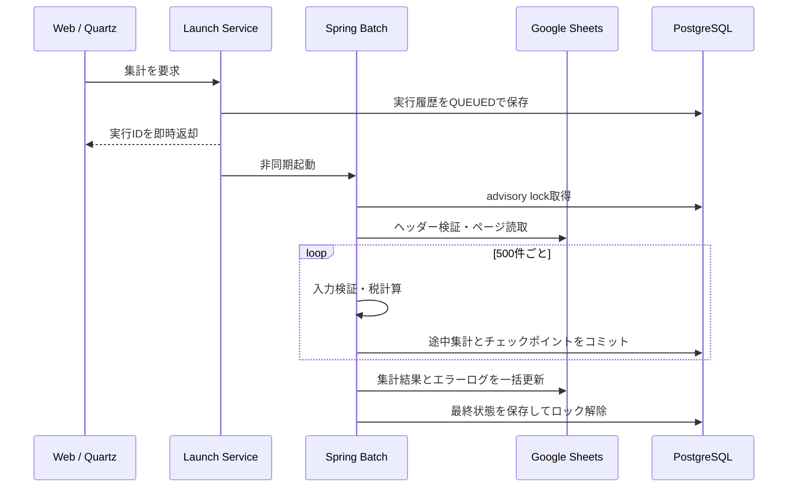

# 売上自動集計システム

Googleスプレッドシートに入力された売上データを、商品・担当者・月ごとに自動集計するSpring Bootアプリケーションです。管理画面からの手動実行と、毎日21:00（Asia/Tokyo）の自動実行に対応しています。

副業案件で求められやすい「外部API連携」「バッチ処理」「DBを使った履歴管理」「運用画面」「エラー処理」を、一つの小規模な業務システムとして実装しています。

## 何ができるシステムなのか

スプレッドシートで管理している日々の売上を、手作業で集計・転記する業務を自動化します。管理者は画面から税区分や実行時刻を設定し、必要なときは手動で集計できます。処理後は商品・担当者・月ごとの集計結果がGoogle Sheetsへ出力され、実行結果とエラー内容は管理画面に残ります。

| 利用場面 | できること |
|---|---|
| 日次の定型業務 | 指定時刻に自動実行し、売上を商品別・担当者別・月別に集計 |
| 急ぎの再集計 | 管理画面から手動実行 |
| 入力ミスの確認 | 不正な行だけを除外し、行番号・原因・修正方法を表示 |
| 障害対応 | 失敗理由と対処方法を確認し、失敗地点から処理を再開 |
| 運用確認 | 実行履歴、処理件数、次回自動実行日時をダッシュボードで確認 |

## 主な機能

- Google Sheetsから最大10,000件の売上データを取得
- 商品別、担当者別、月別、総売上を別シートへ出力
- 税抜・税込を管理画面から選択（税率変更可、初期値10%）
- 税込計算は行単位で1円未満を切り捨て
- 管理画面から非同期で手動実行
- Quartz JDBC JobStoreによる毎日21:00の永続スケジュール
- Spring Batchによる500件単位のチャンク処理、チェックポイント、失敗地点からの再開
- PostgreSQLによる設定、実行履歴、途中集計、エラーの保存
- 不正行を除外し、行番号・項目・修正方法を表示
- PostgreSQL advisory lockによる二重実行防止
- 管理者ログイン、BCrypt、CSRF、CSP、HttpOnly/SameSite Cookie
- Flyway、Docker Compose、GitHub Actions

## 構成図



依存方向を明確にするため、Web層はRepositoryやJPAエンティティを直接参照しません。Service層がユースケースを組み立て、画面には読み取り専用DTOを返します。

| パッケージ | 役割 |
|---|---|
| `web` | HTTP受付、入力値検証、画面遷移 |
| `application` | 手動実行、設定変更、照会などのユースケース |
| `domain` | 売上行の検証、税計算、集計用モデル |
| `batch` | 読取・検証・チャンク集計・結果公開 |
| `quartz` | DB永続型の定時起動 |
| `infrastructure.google` | Google Sheets APIアダプター |
| `infrastructure.persistence` | JPA/JDBC Repositoryと排他制御 |

## 画面キャプチャ

### ダッシュボード

自動・手動の実行履歴、最新結果、次回実行日時、税設定を一画面で確認できます。画面上の実行方法と状態は日本語で表示します。



### 一部除外ありの実行詳細

除外理由、対象行、修正方法を表示します。税率は不要な末尾ゼロを省略して表示します。



### 失敗時の実行詳細

失敗の概要、対処方法、問い合わせやログ検索に使えるエラーコードをまとめて表示します。



## バッチ処理の流れ



`@Scheduled`は使用していません。スケジュールと実行状態をPostgreSQLへ保存できるQuartzを採用し、集計本体はSpring Batchへ分離しています。現状は安全性と実装コストを優先した逐次チャンク処理で、件数増加時はpartition stepへ拡張できます。

## 入力シート

シート名は `売上データ`、A1:E1の見出しは次の順序で固定です。

| 日付 | 担当者 | 商品名 | 数量 | 単価 |
|---|---|---|---:|---:|
| 2026-08-01 | 田中 | 商品A | 2 | 1200 |

- 日付：Google Sheetsの日付セル、または `yyyy-MM-dd`
- 担当者・商品名：必須、100文字以内
- 数量：0以上1,000,000,000以下の整数
- 単価：0円以上1,000,000,000,000円以下の整数
- 完全な空白行は件数に含めません

読み込み用データは [docs/sample-sales.csv](docs/sample-sales.csv) にあります。

## 出力

- `集計結果`：実行条件、処理件数、商品別・担当者別・月別・総売上
- `エラーログ`：実行ID、実行日時、元シートの行番号、項目、エラーコード、修正方法

有効な行が1件もない場合は、正常だった前回の集計結果を保持し、エラーログだけを更新します。

## 起動方法

### 必要なもの

- Docker Desktop
- Google CloudのサービスアカウントJSON
- サービスアカウントへ編集権限を付与したGoogleスプレッドシート

### 1. 環境変数を用意

```bash
cp .env.example .env
mkdir -p secrets
```

サービスアカウントJSONを `secrets/google-service-account.json` に配置します。Google Cloud側ではGoogle Sheets APIを有効化し、JSON内のサービスアカウントメールアドレスを対象スプレッドシートの編集者として共有してください。

`.env` の次の値を変更します。

```dotenv
POSTGRES_PASSWORD=十分に長いDBパスワード
ADMIN_USERNAME=admin
ADMIN_PASSWORD_HASH='生成したBCryptハッシュ'
GOOGLE_SPREADSHEET_ID=スプレッドシートURL内のID
```

HTTPSで公開する本番環境では `SESSION_COOKIE_SECURE=true` にしてください。
`ADMIN_PASSWORD_HASH` が空の場合は、安全のためアプリケーションが起動に失敗します。

BCryptハッシュの生成例です。

```bash
docker run --rm httpd:2.4-alpine htpasswd -bnBC 12 "" "任意の管理者パスワード" | tr -d ':\n'
```

### 2. 起動

```bash
docker compose --profile app up --build
```

[http://localhost:8080](http://localhost:8080) を開き、設定した管理者情報でログインします。

ローカルの5432番ポートが使用中の場合は、`.env` の `POSTGRES_PORT` と `DB_URL` のポートを同じ空き番号へ変更できます。コンテナ版アプリからDBへの接続には影響しません。

### 3. 開発時のテスト

```bash
./mvnw verify
```

Dockerが使用可能な環境では、TestcontainersによるPostgreSQL 17の結合テストも実行されます。Dockerがない環境ではDB結合テストだけがスキップされます。

## 状態とエラー方針

| 内部状態 | 画面表示 | 意味 |
|---|---|---|
| `QUEUED` | 受付済み | 非同期実行の受付済み |
| `RUNNING` | 実行中 | 集計中 |
| `SUCCESS` | 成功 | 全行を正常に集計 |
| `SUCCESS_WITH_WARNINGS` | 一部除外ありで成功 | 不正行を除外して集計 |
| `NO_VALID_DATA` | 有効データなし | 有効行がなく、集計結果は未更新 |
| `SKIPPED_CONCURRENT` | 他の処理を実行中 | 別の集計が実行中 |
| `FAILED` | 失敗 | 起動、入力、DB、Google APIなどで失敗 |
| `UNKNOWN` | 状態不明 | 外部APIの結果を確定できない場合に使用する予約状態 |

Google APIの429と5xx、通信エラーは指数バックオフ付きで既定3回再試行します。画面やスプレッドシートには秘密情報や内部スタックトレースを出さず、追跡には実行IDを使います。

`FAILED` の実行詳細には「失敗地点から再開」ボタンが表示されます。同じSpring Batch JobInstanceを再利用するため、完了済みチャンクは再集計せず、失敗したステップから処理を続行します。再開時も排他ロックを再取得します。

## テストと確認範囲

- 税抜・税込、端数切り捨て
- 必須項目、日付、整数、上限値の検証
- 正常行・異常行のバッチ処理
- チェックポイント再開時の二重加算防止
- 空白区間後の行の読み取り
- PostgreSQLへのFlyway適用と21:00の保持
- Springコンテキスト、JPA、Quartz JDBCスキーマの起動

実Google Sheetsを使う確認項目は [docs/acceptance-test.md](docs/acceptance-test.md) にまとめています。

## 設計上の判断

- **21:00を初期値に採用**：当日の入力が概ね終わった後に日次集計する業務フローを想定。管理画面から変更可能です。
- **PostgreSQLを作業領域にも使用**：全件をメモリへ保持せず、チャンクごとにコミットできます。
- **出力は最後に一括反映**：途中結果が利用者から完成結果に見えることを防ぎます。
- **設定を実行履歴へスナップショット**：実行中に税設定が変わっても、計算条件を後から説明できます。
- **楽観ロックと排他ロックを分離**：設定更新競合とバッチ多重起動を、それぞれ適切な方法で防止します。

## 残存する制約

- Google Sheets APIの実サービス確認には、利用者自身のGoogle Cloud認証情報が必要です。
- 出力直前にネットワーク断が起きた場合、Google側の反映有無を完全には判定できません。出力は同じ実行結果で上書き可能な形にしています。
- エラー詳細のDB保存は最大500件です。正常・異常件数は上限を超えても集計します。
- 管理者は単一ユーザー構成です。複数顧客・権限別運用ではユーザーテーブルと監査ログの拡張が必要です。
- 最大10,000件、逐次チャンク処理を前提としています。大規模化時はAPIクォータ、partition step、出力方式の再設計が必要です。

## AI利用について

要件・採用技術・計算規則・運用方針は利用者が決定し、実装、レビュー、テスト、ドキュメント作成にAIを使用したプロジェクトです。公開・案件提案時は、各層の役割、バッチの処理順序、税計算、障害時の挙動を説明できる状態で使用することを想定しています。
